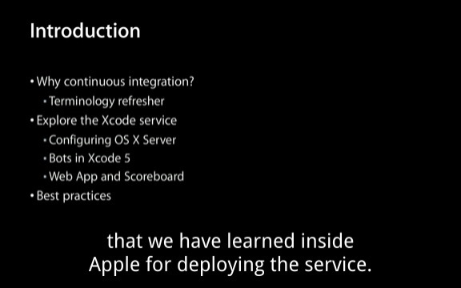
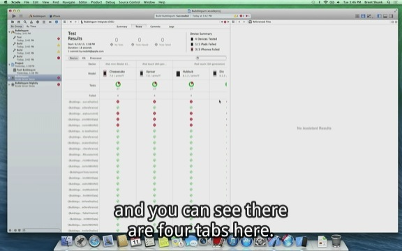

WWDC_2013_Video_Subtitle
========================
WWDC 2013 视频字幕

###1. How I get them?    2 Gist!

* [extract.py][1] (fork from [Nicholas Riley](https://gist.github.com/nriley)'s [extract.py](https://gist.github.com/nriley/5874460))  用来获取视频的`fileSequence*.webvtt`文件，该文件是web格式的字幕文件，苹果把字幕文件切分成了很多小段，每一段是一个独立的`fileSequence*.webvtt`文件。(`*`表示序号，从0开始)，使用的方法我写在了Comment里了。
	

* [wwdc_combine_webvtt.rb](https://gist.github.com/qiaoxueshi/5992949) 这个gist的功能是将上面获得的很多`fileSequence*.webvtt`文件合并一整个文件，其实格式理论上还是webvtt，不过我试了一下，在MPlayerX中是可以完美的显示出来的。这个script是现学的ruby现用，欢迎批评和pull request。

###2.欢迎大家提交pull request补充其他video字幕

在用[extract.py][1]脚本获得字幕的时候比较慢，可能是我这边网络的问题，大家如果通过上面的两个脚本拿到了剩余Video的字幕欢迎pull request和大家分享。

###3. 有图有真相

[1]: https://gist.github.com/qiaoxueshi/5976402